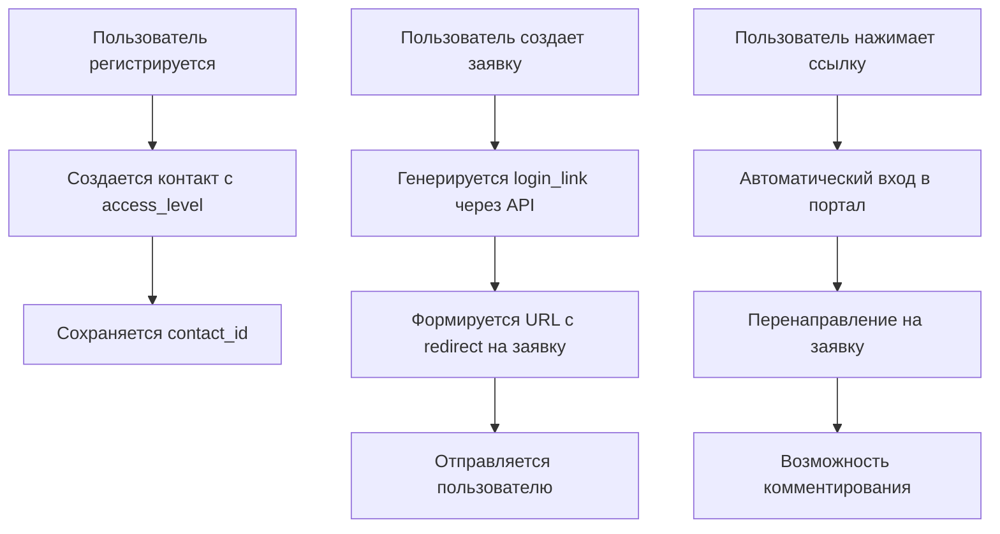

# 🔧 Техническая документация: Интеграция с клиентским порталом OkDesk

## 📋 Обзор изменений

Система была дополнена функциональностью автоматического создания ссылок для входа в клиентский портал OkDesk с возможностью комментирования заявок через браузер.

## 🏗️ Архитектура решения

### Основные компоненты

1. **PortalURLGenerator** (`update_urls.py`) - класс для генерации ссылок портала
2. **OkdeskAPI.create_login_link()** - метод API для создания ссылок входа  
3. **OkdeskAPI.create_contact_with_portal_access()** - создание контактов с доступом к порталу
4. **Обновленные handlers** - интеграция новых кнопок и ссылок

### Схема работы



## 🔌 API Integration

### Создание ссылки для входа

**Endpoint:** `POST /api/v1/login_link`

```python
data = {
    'user_type': 'contact',
    'user_id': contact_id,
    'expire_after': 43200,  # 30 дней
    'one_time': False       # Многоразовая ссылка
}
```

**Ответ:**
```json
{
    "login_link": "https://example.okdesk.ru/login?token=abc123",
    "user_id": 78,
    "user_type": "contact",
    "user_first_name": "Иван",
    "user_last_name": "Петров"
}
```

### Создание контакта с доступом к порталу

```python
contact_response = await okdesk_api.create_contact_with_portal_access(
    first_name="Иван",
    last_name="Петров", 
    phone="+79261234567",
    access_level=[
        'company_issues',  # Отображать заявки компании
        'allow_close_company_issues'  # Разрешить закрывать заявки
    ]
)
```

## 📁 Новые файлы и функции

### `update_urls.py`

#### Класс PortalURLGenerator
- `create_login_link()` - создание ссылки входа
- `get_issue_portal_url()` - ссылка на конкретную заявку
- `get_portal_main_url()` - главная страница портала
- `get_simple_issue_url()` - простая ссылка без авторизации

#### Функции
- `update_user_portal_access()` - обновление доступа пользователя
- `get_enhanced_issue_urls()` - создание расширенных ссылок
- `test_portal_integration()` - тестирование интеграции

### Изменения в `services/okdesk_api.py`

#### Новые методы
- `create_login_link()` - API метод создания ссылки входа
- `create_contact_with_portal_access()` - создание контакта с правами

### Изменения в handlers

#### `handlers/registration.py`
- Обновлен процесс создания контактов при регистрации
- Добавлено создание логинов и паролей для портала
- Установка `access_level` для доступа к заявкам

#### `handlers/issues.py`
- Обновлено формирование ссылок при создании заявок
- Новые кнопки в интерфейсе
- Добавлены обработчики `main_menu` и `profile`
- Интеграция с PortalURLGenerator

## ⚙️ Конфигурация

### Переменные окружения
- `OKDESK_PORTAL_URL` - базовый URL портала
- `OKDESK_API_TOKEN` - токен API с правами создания login_link

### Настройки доступа
```python
ACCESS_LEVELS = [
    'company_issues',           # Просмотр заявок компании
    'allow_close_company_issues' # Закрытие заявок компании
]
```

## 🧪 Тестирование

### Запуск тестов
```bash
python update_urls.py test
```

### Что тестируется
1. Создание тестового контакта
2. Генерация ссылки входа
3. Создание ссылки с redirect на заявку
4. Проверка формата ответов API

### Ожидаемый результат
```python
{
    'success': True,
    'test_contact_id': 79,
    'login_url': 'https://example.okdesk.ru/login?token=abc123',
    'issue_url': 'https://example.okdesk.ru/login?token=xyz456&redirect=issues/1'
}
```

## 🔍 Диагностика

### Логирование
Все операции логируются с уровнем INFO:
- Создание контактов
- Генерация ссылок
- API запросы и ответы
- Ошибки обработки

### Типичные проблемы

#### 1. Не создается ссылка входа
**Причина:** Недостаточно прав у API токена
**Решение:** Проверить права токена в настройках OkDesk

#### 2. Ошибка "contact_id не найден"
**Причина:** Пользователь не полностью зарегистрирован
**Решение:** Повторная регистрация через `/start`

#### 3. Ссылка ведет на страницу входа
**Причина:** Истек токен или некорректный user_id
**Решение:** Перегенерировать ссылку

## 🚀 Развертывание

### Зависимости
```bash
pip install aiohttp python-dotenv psycopg2-binary aiogram
```

### Обновление существующих URL
```bash
python update_urls.py
```

### Проверка интеграции
```bash 
python update_urls.py test
```

## 📊 Метрики и мониторинг

### Ключевые метрики
- Количество созданных ссылок входа
- Успешность создания контактов с правами портала
- Время ответа API login_link
- Количество переходов в портал

### Логи для мониторинга
```python
logger.info(f"✅ Создана ссылка входа: {login_url}")
logger.info(f"✅ Контакт создан с ID={contact_id} и доступом к порталу")
logger.error(f"❌ Не удалось создать ссылку входа: {response}")
```

## 🔒 Безопасность

### Токены входа
- Время жизни: 30 дней (43200 минут)
- Тип: многоразовые для удобства
- Привязка: к конкретному contact_id

### Права доступа
- Ограничены только заявками своей компании
- Запрет на административные операции
- Логирование всех действий

## 📈 Производительность

### Оптимизации
- Кэширование ссылок входа на стороне бота
- Fallback к простым ссылкам при ошибках API
- Асинхронные запросы к API

### Рекомендации
- Не генерировать новые ссылки при каждом запросе
- Использовать существующие токены если они не истекли
- Мониторить время ответа API

---

## 🤝 Поддержка

Для вопросов по технической реализации или проблем с интеграцией обращайтесь к документации API OkDesk или создавайте issue в репозитории проекта.