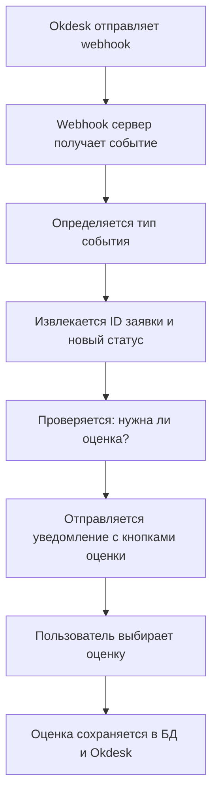

# Реализация системы уведомлений и оценок при закрытии заявок

## Что было реализовано

### 1. ✅ Автоматические уведомления при закрытии заявки

При смене статуса заявки на один из статусов завершения (`resolved`, `closed`, `completed`, `done`, `finished`, `solved`) система автоматически:

- 🔔 **Отправляет уведомление** пользователю в Telegram с информацией о смене статуса
- ⭐ **Предлагает оценить** качество выполненной работы (от 1 до 5 звезд)
- 🎯 **Показывает красивые кнопки** с эмодзи звездочек для удобной оценки

### 2. ✅ Система сбора и обработки оценок

- 📊 **Сохранение оценок** в базе данных бота
- 💬 **Отправка оценок** в Okdesk через API в виде комментариев к заявке
- 🚫 **Защита от повторных оценок** одной и той же заявки
- 📝 **Персонализированные благодарности** в зависимости от оценки

### 3. ✅ Улучшенная обработка webhook'ов

- 🎯 **Автоматическое определение типа события** (создание, обновление, смена статуса)
- 🔄 **Нормализация статусов** через маппинг для поддержки разных форматов
- 📡 **Поддержка различных форматов** webhook данных от Okdesk
- 🔐 **Опциональная проверка подписи** webhook'ов для безопасности

## Измененные файлы

### `config.py`
- ➕ Добавлены новые статусы в `ISSUE_STATUS_MESSAGES`
- ➕ Создан список `RATING_REQUEST_STATUSES` для статусов, требующих оценки  
- ➕ Добавлен `OKDESK_STATUS_MAPPING` для нормализации статусов
- ➕ Добавлен `RATING_REQUEST_TEXT` с текстом запроса оценки

### `webhook_server.py`
- 🔄 Улучшена функция `notify_user_status_change()` с запросом оценки
- 🔄 Обновлена `handle_status_changed()` с поддержкой нормализации статусов
- 🔄 Улучшена обработка различных форматов webhook событий
- ➕ Добавлена логика отображения кнопок оценки при закрытии заявки

### `handlers/issues.py`
- 🔄 Улучшена функция `handle_rating()` с проверкой повторных оценок
- ➕ Добавлены персонализированные сообщения благодарности
- 🔄 Улучшено отображение результата оценки

## Новые файлы

### `test_rating_simple.py`
- 🧪 Комплексное тестирование системы без подключения к БД
- ✅ Проверка маппинга статусов
- ✅ Тестирование обработки webhook данных
- ✅ Валидация конфигурации

### `RATING_WEBHOOK_SETUP.md`
- 📖 Подробная документация по настройке webhook'ов в Okdesk
- 🔧 Инструкции по конфигурации
- 🧪 Примеры тестирования
- 🚨 Решение возможных проблем

## Как это работает

### 1. Настройка webhook'ов в Okdesk
```
URL: https://ваш-домен/okdesk-webhook
События: issue.status_changed, issue.updated
Формат: JSON
```

### 2. Обработка изменения статуса


### 3. Пример уведомления
```
📊 Статус заявки #1380 изменился

📝 Настройка телефонии

🔄 Новый статус: ✅ Заявка решена

⭐ Ваша заявка была решена!

Пожалуйста, оцените качество выполненной работы.
Ваша оценка поможет нам улучшить качество обслуживания.

[⭐⭐⭐⭐⭐ Отлично (5)] [⭐⭐⭐⭐ Хорошо (4)]
[⭐⭐⭐ Нормально (3)] [⭐⭐ Плохо (2)] [⭐ Ужасно (1)]
```

## Статусы, запрашивающие оценку

- `resolved` - Решена
- `closed` - Закрыта
- `completed` - Выполнена  
- `done` - Выполнена
- `finished` - Завершена
- `solved` - Решена
- `complete` - Выполнена
- `finish` - Завершена
- `close` - Закрыта

## Протестировано

✅ Парсинг различных форматов webhook данных  
✅ Маппинг и нормализация статусов  
✅ Определение необходимости запроса оценки  
✅ Генерация кнопок оценки  
✅ Конфигурация системы  

## Требует тестирования в реальной среде

🧪 Получение реальных webhook'ов от Okdesk  
🧪 Отправка уведомлений в Telegram  
🧪 Обработка оценок пользователей  
🧪 Сохранение оценок в Okdesk через API  

## Следующие шаги

1. **Настроить webhook'и в Okdesk** согласно `RATING_WEBHOOK_SETUP.md`
2. **Запустить контейнеры**: `docker-compose up -d`
3. **Создать тестовую заявку** и изменить её статус на "Решена"
4. **Проверить получение уведомления** в Telegram
5. **Протестировать систему оценок** нажатием на кнопки
6. **Проверить сохранение оценки** в комментариях Okdesk

## Конфигурация

Добавьте в `.env`:
```env
WEBHOOK_SECRET=ваш-секретный-ключ-для-безопасности
```

Система готова к работе! 🚀